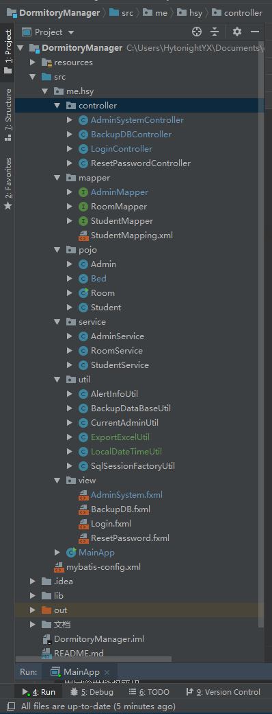
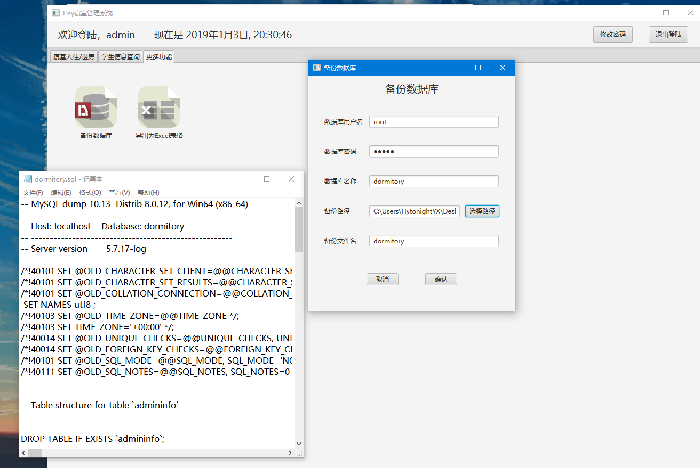

# HSY寝室管理系统

### 技术栈
```
JavaFx2     
Mybatis3
```


### 开发环境
``` 
Java 1.8   
Idea-2018.3
```

### 项目结构
```
MVC（模型Model-视图View-控制器Controller）
```



### 效果图与功能介绍
1、登陆
- 初次登陆必须修改密码


2、修改密码
- 健壮性：单击确认按钮后会检查数据库用户名是否存在、原始密码是否正确、新密码和确认密码是否一致、新密码是否超过6位


3、系统主界面
* 寝室入住/退房页面
    * 操作逻辑：点击左侧选择一个房间，该房间详情会显示在右上角table中，点击右上角table可以选中床位，并且根据当前床位的状态（有人或无人）来选择性屏蔽右下角tab
    * 可以根据房间号模糊搜索房间，例如，输入2可以显示出所有房间号中含有2的房间：102, 201等等
    * 健壮性：选中床位自动屏蔽入住或退房中某一个tab，选中存在不合法信息的床位或者房间则会屏蔽入住退房两个tab；入住操作只能根据完整学号查询并且填充，不可编辑。退房操作在选中床位后自动填充，不可编辑。
    * 顶部显示欢迎信息， 显示当前时间， 有修改当前用户密码和退出按钮
    


* 学生信息查询页面
    * 学生支持多条件查询
    * 寝室条件则必须输入完整寝室号，会在右侧列表显示入住该寝室的成员详细信息


* 更多功能页面
    * 备份数据库：需提供用户名、密码、数据库名称、路径、文件名等信息
    * 导出Excel表格功能正在开发中...
    
